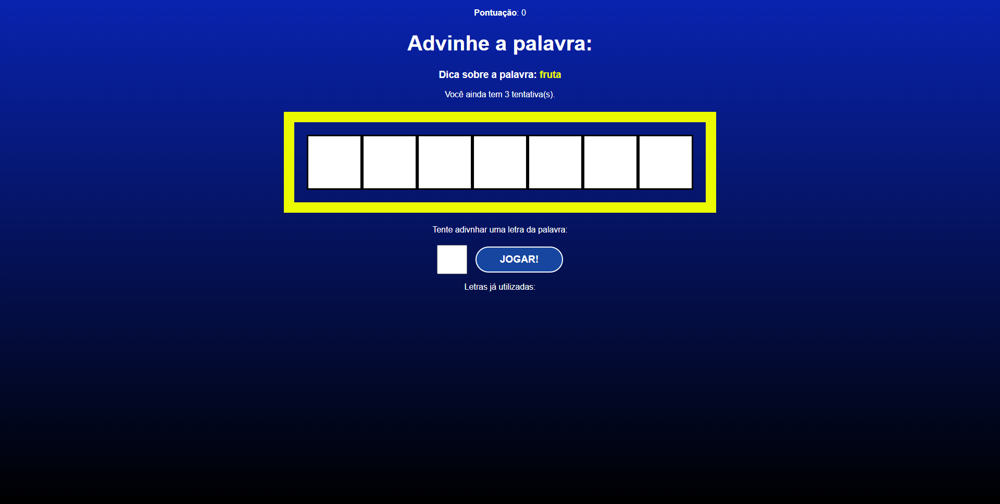

# Secret Word



# <a href="https://secret-word-two-chi.vercel.app/" target="_blank">Secret Word</a>


Projeto criado utilizando React e css.
No jogo você pode estar advinhando palavras, tipo o jogo do roda a roda, nele você vai colocando as letras e vendo se acertou ou não a palavra.


## Instalação

Instale my-project com npm

```bash
  npm install secret-word
  cd secret-word
```
    
## Deploy

Para fazer o deploy desse projeto rode

```bash
  npm run dev
```


## Autores

- [@AlbericoJr](https://www.github.com/albericojr)


## Etiquetas

Adicione etiquetas de algum lugar, como: [shields.io](https://shields.io/)

[](https://choosealicense.com/licenses/mit/)
[](https://opensource.org/licenses/)
[](http://www.gnu.org/licenses/agpl-3.0)

